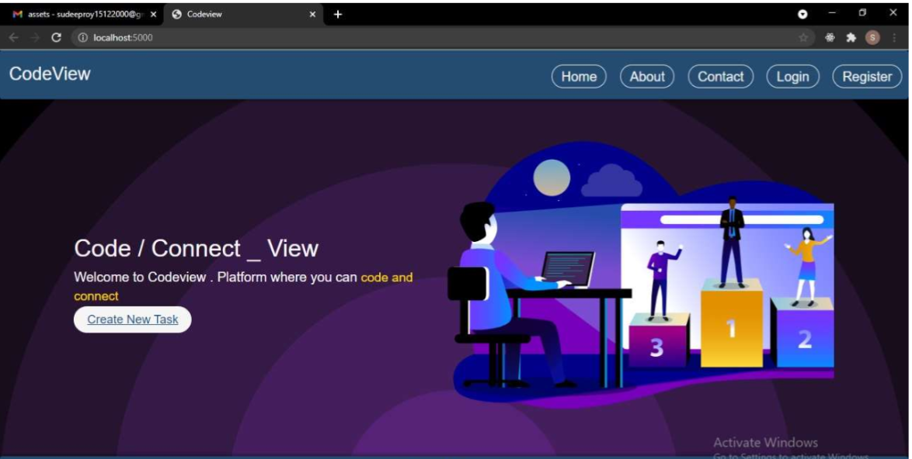
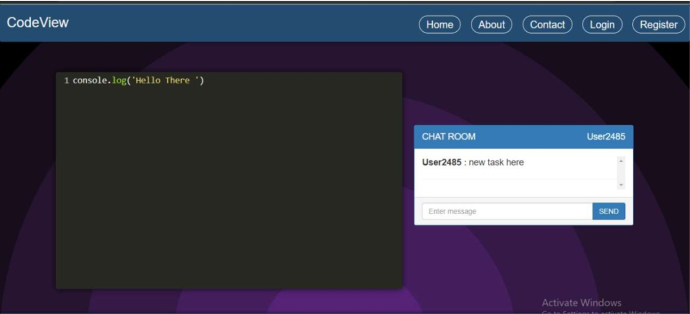
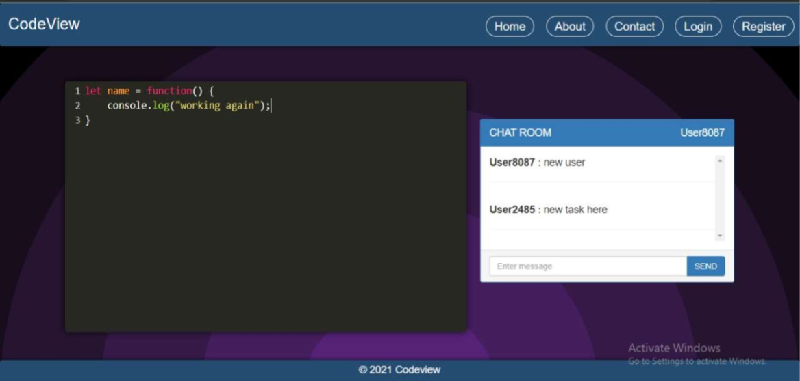

# Code View

Code View is a collaborative real-time code editor and viewer. This project enables users to edit and share code with others seamlessly using modern web technologies.

## Features
- **Real-time Collaboration:** Edit and view code with multiple users simultaneously.
- **Rich User Interface:** Built using HTML, CSS, and JavaScript for an intuitive user experience.
- **Backend with Node.js and Express:** Handles server-side logic and communication.
- **Database Management:** MongoDB for storing user data and session details.
- **WebSockets:** Enables real-time communication using the `socket.io` library.

## Tech Stack
- **Frontend:** HTML, CSS, JavaScript
- **Backend:** Node.js, Express
- **Database:** MongoDB
- **Real-time Communication:** Socket.io

## 🖼️ Screenshots

### 1. Home Page


### 2. Code View in Action



---

## Installation

### Prerequisites
Make sure you have the following installed:
- [Node.js](https://nodejs.org/)
- [MongoDB](https://www.mongodb.com/)

### Steps
1. Clone the repository:
   ```bash
   git clone https://github.com/yourusername/code-view.git
   cd code-view

